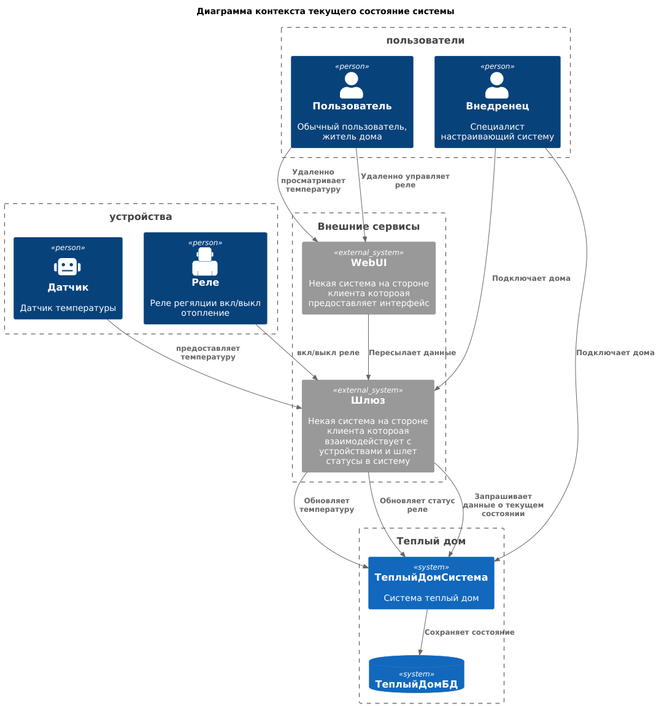
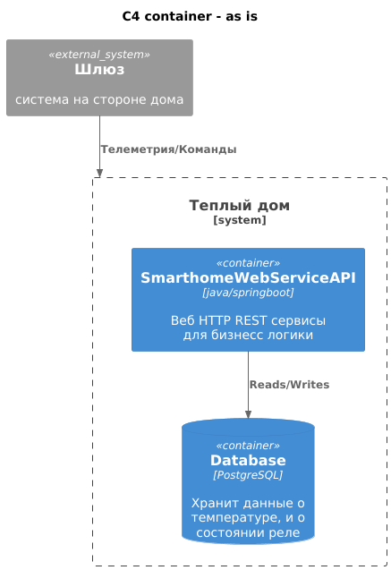
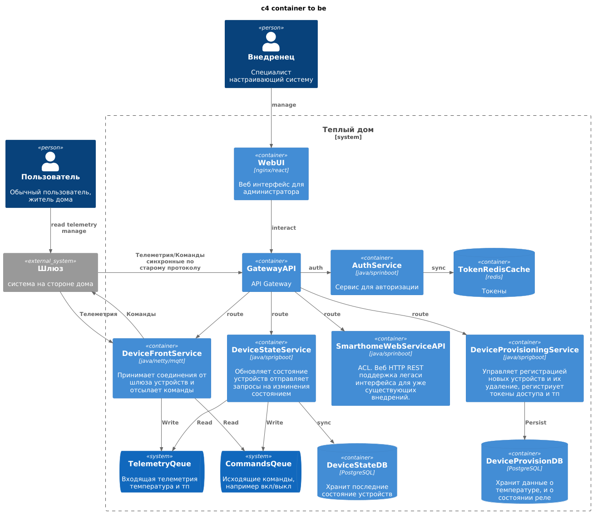
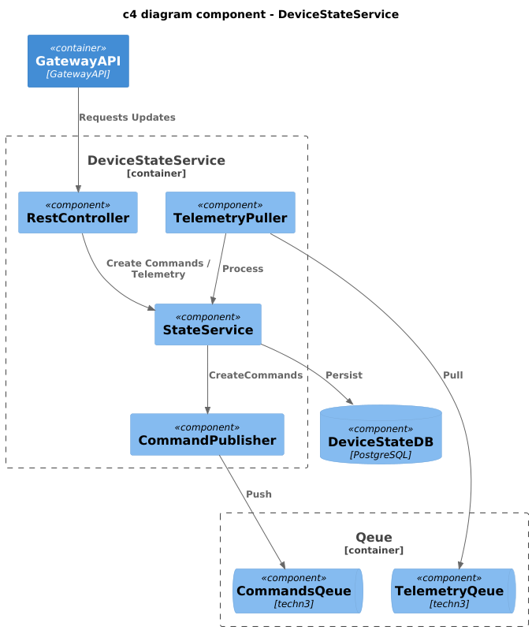
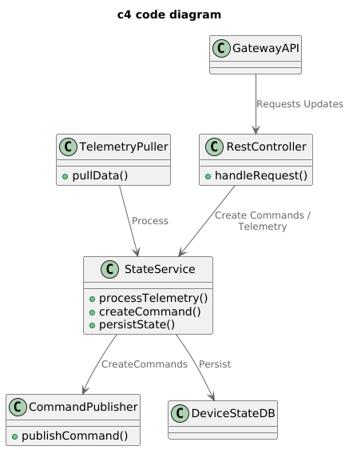
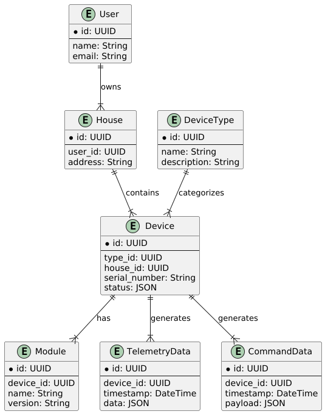

Это шаблон для решения **первой части** проектной работы. Структура этого файла повторяет структуру заданий. Заполняйте его по мере работы над решением.

# Задание 1. Анализ и планирование

Чтобы составить документ с описанием текущей архитектуры приложения, можно часть информации взять из описания компании условия задания. Это нормально.

### 1. Описание функциональности монолитного приложения

**Управление отоплением:**

- Пользователи могут включать/выключать отопление в своих домах
- Система поддерживает только опредленные реле

**Мониторинг температуры:**

- Пользователи могут проверять температуру
- Система поддерживает только опредлеенные датчики

### 2. Анализ архитектуры монолитного приложения

Перечислите здесь основные особенности текущего приложения: какой язык программирования используется, какая база данных, как организовано взаимодействие между компонентами и так далее.

Данное приложение java spring boot приложение которое работает с базой postgresql.
В Приложении не представлен веб интерфейс, хотя он и упоминается в описании исходного состояния системы.
Будет далее рассматриваться как внешний компонент.

Само приложение организованно как монолит, по классической схеме для spring boot приложение, с разделением на слои бизнесс логики и работы с базой.
Взаимодействие идет по HTTP REST синхронно.
Аутентификация и авторизация ни как не представленна.
Также не представлено и api для подключения домов на стадии внедрения. Они просто каким-то образом добавляются в базу.

### 3. Определение доменов и границы контекстов

Четко выделяются 3ри домена

- управление устройствами
- мониторинг
- внедрение(подключение новых объектов к системе)

### **4. Проблемы монолитного решения**

- не представлено апи для внедрения/подключения объектов к системе
- не удовлетворяет потребности в росте бизнесса
- в коде который представлен в системе нет работы с телеметрией и управлением устройствами.
_просто сохранение в базу, предположение, что это также не является проблемой и просто код условный для примера. Либо что управление реле ведется некой системой на стороне самого дома._

в остальном критических проблем нет, без дополнительных вводных веделить сложно,
можно например указать на синхронность, что при работе с устройствами по сети может сильно снижать UX
по причине сложностей сетевого взаимодействия от сервера к конкретным устройствам, но такие проблемы не обозначены,
а асинхронность влечет за собой издержки неопределенности состояния, и более сложную отладку. 

в целом система больше похоже на бакенд

### 5. Визуализация контекста системы — диаграмма С4

Добавьте сюда диаграмму контекста в модели C4.

Чтобы добавить ссылку в файл Readme.md, нужно использовать синтаксис Markdown. Это делают так:

[c4_current_context](diagrams/c4_context__as_is.puml)

# Задание 2. Проектирование микросервисной архитектуры

В этом задании вам нужно предоставить только диаграммы в модели C4. Мы не просим вас отдельно описывать получившиеся микросервисы и то, как вы определили взаимодействия между компонентами To-Be системы. Если вы правильно подготовите диаграммы C4, они и так это покажут.

[C4 container as is](diagrams/с4_container__as_is.puml)

[C4 container to be](diagrams/с4_container__to_be.puml)

**Диаграмма компонентов (Components)**

Добавьте диаграмму для каждого из выделенных микросервисов.

[c4_a_component_to_be](diagrams/с4_component__device_state_service__to_be.puml)

**Диаграмма кода (Code)**

Добавьте одну диаграмму или несколько.

[c4 code diagram](diagrams/c4_code_diagram.puml)

# Задание 3. Разработка ER-диаграммы

Добавьте сюда ER-диаграмму. Она должна отражать ключевые сущности системы, их атрибуты и тип связей между ними.

[c4 code diagram](diagrams/er_diagram.puml)

